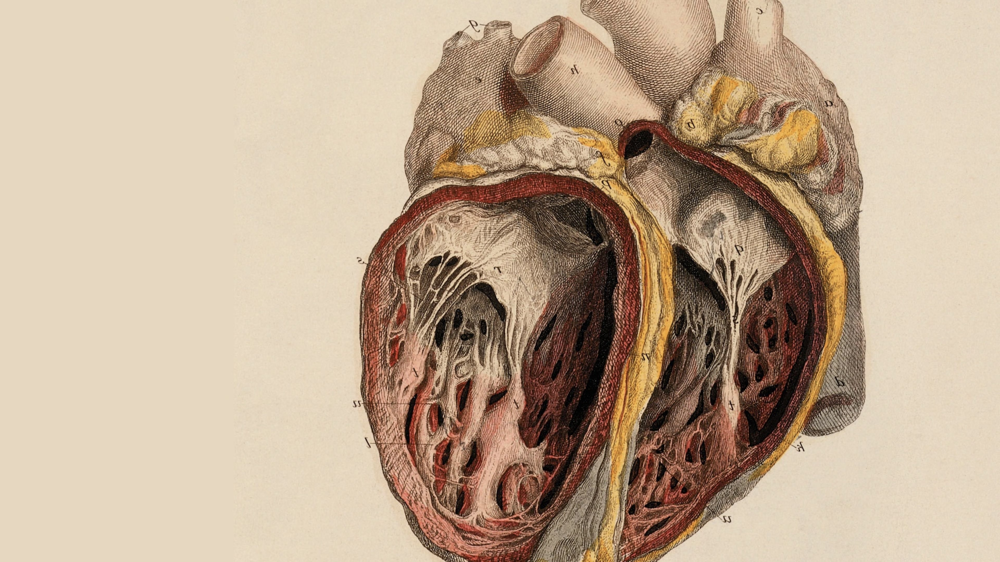

<!DOCTYPE html>
<html>
<head>
<meta charset="utf-8">
<meta name="viewport" content="width=device-width, initial-scale=1">

</head>
<body>
<x-dc>
<helmet data-dc-atomics>
<link rel="preconnect" href="https://fonts.googleapis.com">
<link href="https://fonts.googleapis.com/css2?family=Newsreader:ital,opsz,wght@0,6..72,400;0,6..72,500;0,6..72,600;1,6..72,400;1,6..72,500&family=IBM+Plex+Mono:wght@400;500&display=swap" rel="stylesheet">
<link rel="icon" type="image/svg+xml" href="brand/gks-favicon.svg">

</helmet>

  
GKS

  

  

    <a href="Home.dc.html" style="font-size:17px;font-weight:600;font-style:italic;color:#221c18;text-decoration:none">Gabriel K. Staniszewski</a>
    

      <a href="Home.dc.html" style="color:#221c18;text-decoration:none;border-bottom:1px solid oklch(0.5 0.16 25);padding-bottom:2px">Home</a>
      <a href="About.dc.html" style="color:#6b5f52;text-decoration:none">About</a>
      <a href="CV.dc.html" style="color:#6b5f52;text-decoration:none">CV</a>
      <a href="Portfolio.dc.html" style="color:#6b5f52;text-decoration:none">Portfolio</a>
      <a href="Blog.dc.html" style="color:#6b5f52;text-decoration:none">Blog</a>
      <a href="Contact.dc.html" style="color:#6b5f52;text-decoration:none">Contact</a>
    

  

  

    
FROM LUBLIN, OF BOSTON

    <h1 style="margin:0;font-size:62px;font-weight:500;line-height:1.06;letter-spacing:-.01em;max-width:800px;text-wrap:balance">A future built one heartbeat at a time.</h1>
    
Medical student, aspiring cardiac surgeon, and grandson of people who refused to give up. I study the heart for the simplest reason there is: every beat counts.

    

      <a href="About.dc.html" style="padding:14px 30px;background:#221c18;color:#f7f3ec;font-size:14px;font-weight:600;text-decoration:none">My story</a>
      <a href="Portfolio.dc.html" style="padding:14px 30px;border:1px solid #c9bfae;color:#221c18;font-size:14px;font-weight:600;text-decoration:none">View portfolio</a>
    

  

  

    
    

      

        
Research

        
Where fluid dynamics meets the failing artery

        
CFD modeling of arterial stenosis in high school — the project that set the course toward cardiovascular medicine.

        <a href="Portfolio.dc.html" style="font:600 13px Helvetica,Arial,sans-serif;color:#221c18;text-decoration:none;margin-top:4px">Explore the research →</a>
      

      

        
Heritage

        
A lineage of resilience

        
Great-grandparents who fought for Poland; grandparents who outlasted communism. Their courage is my compass.

        <a href="About.dc.html" style="font:600 13px Helvetica,Arial,sans-serif;color:#221c18;text-decoration:none;margin-top:4px">Read the story →</a>
      

      

        
Curriculum vitae

        
Shared personally, on request

        
Write to me and I'll send the full CV along with a proper hello.

        <a href="CV.dc.html" style="font:600 13px Helvetica,Arial,sans-serif;color:#221c18;text-decoration:none;margin-top:4px">Request the CV →</a>
      

    

  

  <a href="About.dc.html" style="display:block;position:relative;height:340px;overflow:hidden;text-decoration:none">
    
    

    

      
LUBLIN, POLAND

      
The city where I'm learning medicine — and where my story began generations ago.

    

  </a>

  

    
    

    <a href="Blog.dc.html" style="position:absolute;left:56px;top:50%;transform:translateY(-50%);display:flex;flex-direction:column;gap:8px;max-width:340px;text-decoration:none;color:#221c18">
      
THE BLOG

      
Notes on the heart — coming soon

    </a>
  

  

    GKS — every beat counts. &nbsp;·&nbsp; Lublin, Poland — <a href="mailto:staniszewski.gabriel.k@gmail.com" style="color:#8a7d6d">staniszewski.gabriel.k@gmail.com</a>
    
      <a href="https://www.linkedin.com/in/gabriel-staniszewski-33a3a7256" style="color:#8a7d6d;text-decoration:none">LinkedIn</a>
      <a href="https://www.instagram.com/gabriel.is.up/" style="color:#8a7d6d;text-decoration:none">Instagram</a>
    
  

</x-dc>
</body>
</html>
